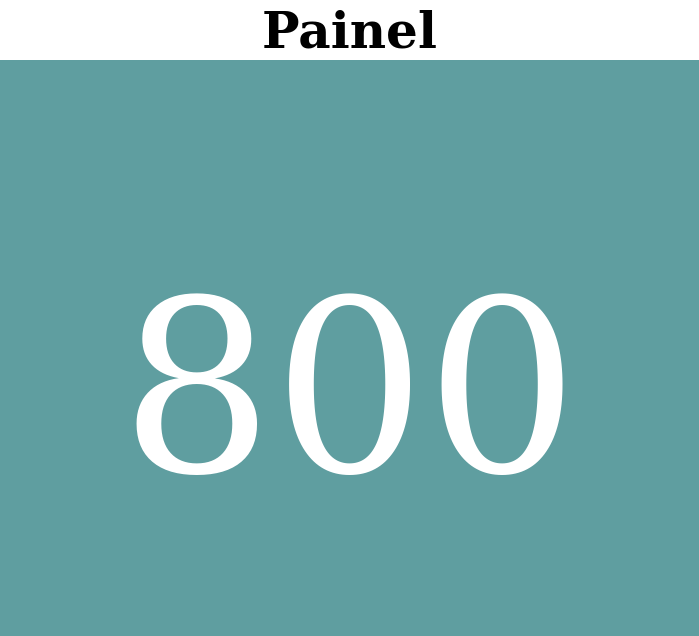
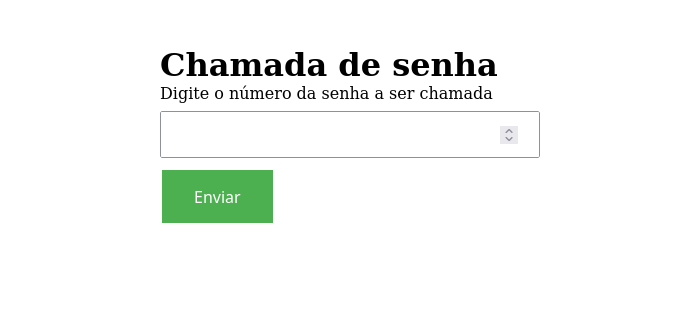

# Painel

Painel de chamada de senha

### Tecnologias utilizadas no projeto;

- NodeJs
- ExpressJs
- Template engine ejs and mustache
- Socket.io

### Start do projeto

```shell
npm install && npm start

```

### Urls

Painel:
http://localhost:3000/

Chamada de senha http://localhost:3000/chamada

### Imagens do painel



